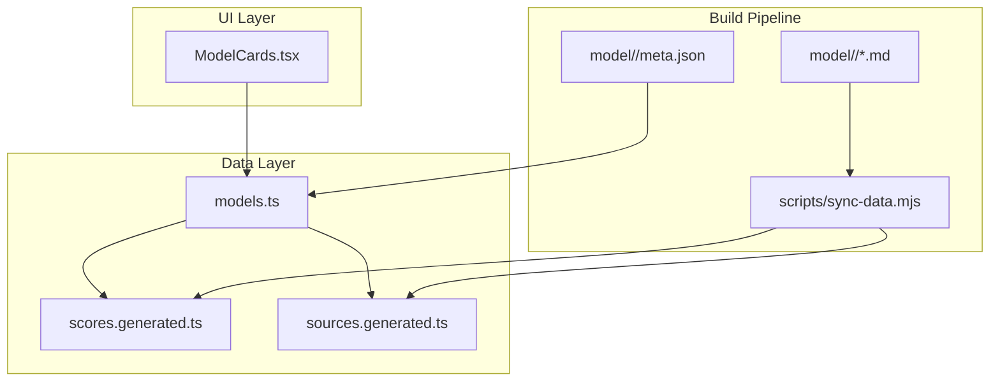
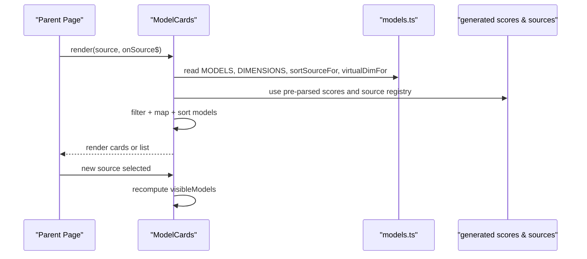
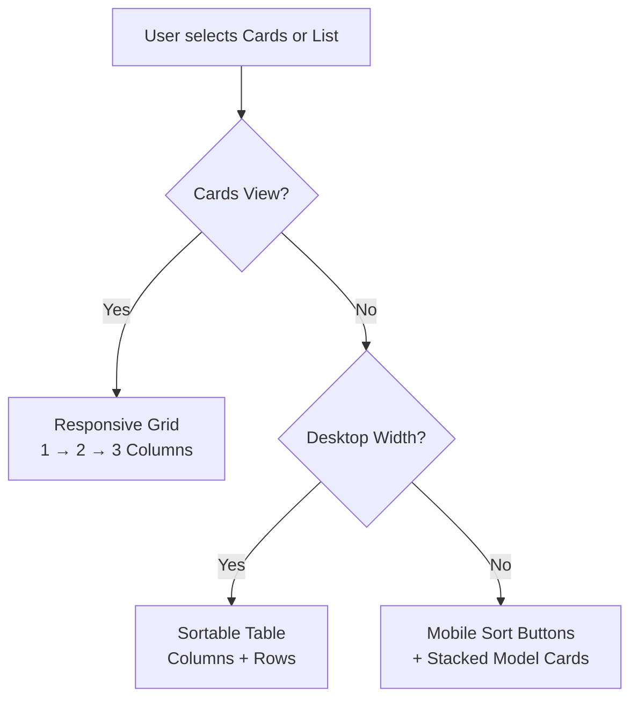
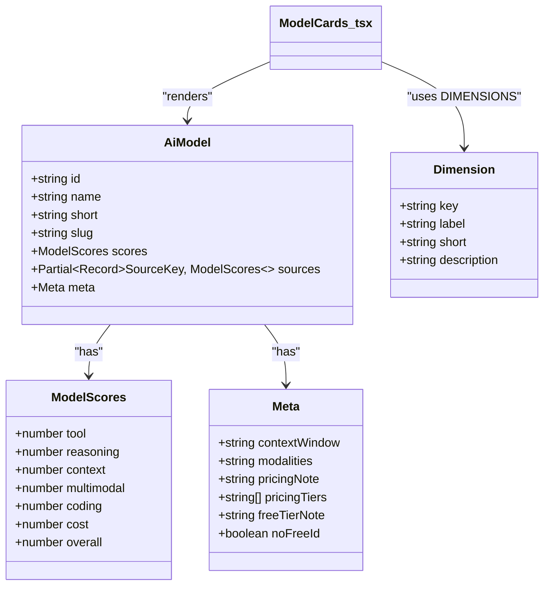
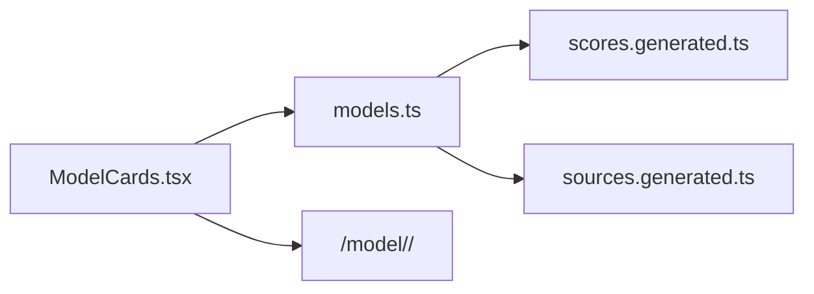

# ModelCards Display Component

<cite>
**Referenced Files in This Document**
- [ModelCards.tsx](file://src/components/ModelCards.tsx)
- [models.ts](file://src/data/models.ts)
- [scores.generated.ts](file://src/data/scores.generated.ts)
- [sources.generated.ts](file://src/data/sources.generated.ts)
- [README.md](file://README.md)
</cite>

## Table of Contents
1. [Introduction](#introduction)
2. [Project Structure](#project-structure)
3. [Core Components](#core-components)
4. [Architecture Overview](#architecture-overview)
5. [Detailed Component Analysis](#detailed-component-analysis)
6. [Dependency Analysis](#dependency-analysis)
7. [Performance Considerations](#performance-considerations)
8. [Troubleshooting Guide](#troubleshooting-guide)
9. [Conclusion](#conclusion)

## Introduction
The ModelCards component is the primary UI surface for browsing and comparing AI models. It renders a responsive grid of model cards, an exact-scores table, and mobile-friendly list summaries. The component displays model metadata (name, short description, context window, modalities, pricing), scores across six dimensions, and contextual badges such as Free or Paid. It supports two display modes:

- Cards view: a responsive card grid with summary information per model.
- List view: a sortable table on desktop and a stacked list on mobile.

The component integrates with the project’s data pipeline so that every displayed number comes from pre-parsed benchmark results rather than hardcoded values.

## Project Structure
ModelCards lives under `src/components` and consumes typed model data from `src/data/models.ts`. The data layer imports auto-generated score and source registries produced by the build-time sync script.

**Diagram sources**
- [ModelCards.tsx:1-4](file://src/components/ModelCards.tsx#L1-L4)
- [models.ts:6-16](file://src/data/models.ts#L6-L16)
- [models.ts:18-19](file://src/data/models.ts#L18-L19)
- [README.md:31-44](file://README.md#L31-L44)

**Section sources**
- [README.md:31-44](file://README.md#L31-L44)
- [README.md:61-72](file://README.md#L61-L72)

## Core Components
ModelCards is a Qwik component that receives:

- `source`: the active results view (average, virtual dimension views, or a reporting agent).
- `onSource$`: a QRL callback to update the global results view.

Internally, it manages:

- `displayCount`: how many models are initially rendered before “Show more”.
- `view`: whether the user is in cards or list mode.
- `sortDim` and `isVirtualView`: derived state indicating whether the current view ranks by a specific dimension.

It computes a filtered and sorted list of models based on the selected source, then renders either cards or a list/table depending on the view mode.

Key responsibilities:

- Present model identity and navigation links.
- Show Overall score prominently.
- Render Free/Paid status using curated metadata.
- Display short description and contextual details.
- Render six dimension scores.
- Provide sorting controls for both table headers and mobile filter chips.
- Paginate large datasets through incremental loading.

**Section sources**
- [ModelCards.tsx:6-28](file://src/components/ModelCards.tsx#L6-L28)

## Architecture Overview
The component follows a unidirectional data flow:

1. The parent route or page supplies the active `source`.
2. ModelCards filters and sorts `MODELS` according to that source.
3. For non-average sources, it temporarily swaps each model’s `scores` with the selected source’s scores.
4. It renders the selected view (cards or list).
5. Sorting changes call back into the parent via `onSource$`.

**Diagram sources**
- [ModelCards.tsx:1-28](file://src/components/ModelCards.tsx#L1-L28)
- [models.ts:243-274](file://src/data/models.ts#L243-L274)
- [models.ts:220-241](file://src/data/models.ts#L220-L241)

## Detailed Component Analysis

### Card Layout Structure
Each card is an `<article>` element containing:

- A header row with the model name link and Overall badge.
- A Free or Paid fallback badge derived from `meta.noFreeId`.
- A short description paragraph.
- A definition list showing Context, Modalities, and Pricing.
- A compact line listing all six dimension scores.

This structure keeps the most important information visible while allowing users to scan quickly.

**Diagram sources**
- [ModelCards.tsx:74-125](file://src/components/ModelCards.tsx#L74-L125)

**Section sources**
- [ModelCards.tsx:74-125](file://src/components/ModelCards.tsx#L74-L125)

### Content Organization
The component organizes content into three layers:

1. **Identity and ranking:** name, slug-based navigation, and Overall score.
2. **Contextual metadata:** context window, modalities, and pricing notes or tiers.
3. **Scores:** six normalized dimensions plus Overall.

Pricing can be a single note or multiple tiers. When `pricingTiers` exists, the list view shows each tier; otherwise, it falls back to `pricingNote`.

**Section sources**
- [ModelCards.tsx:88-122](file://src/components/ModelCards.tsx#L88-L122)
- [ModelCards.tsx:232-239](file://src/components/ModelCards.tsx#L232-L239)
- [ModelCards.tsx:325-334](file://src/components/ModelCards.tsx#L325-L334)

### Responsive Design Patterns
ModelCards uses Tailwind utility classes to adapt between screens:

- Cards grid: one column on small screens, two columns on medium screens, three columns on large screens.
- List view:
  - Desktop: a full table with fixed column widths and horizontal scrolling if needed.
  - Mobile: a set of sort buttons and stacked list cards per model.
- Typography scales up on larger screens for headings.
- Dark mode colors are applied consistently across light and dark themes.

**Diagram sources**
- [ModelCards.tsx:74-76](file://src/components/ModelCards.tsx#L74-L76)
- [ModelCards.tsx:128-138](file://src/components/ModelCards.tsx#L128-L138)
- [ModelCards.tsx:245-279](file://src/components/ModelCards.tsx#L245-L279)
- [ModelCards.tsx:280-338](file://src/components/ModelCards.tsx#L280-L338)

**Section sources**
- [ModelCards.tsx:74-76](file://src/components/ModelCards.tsx#L74-L76)
- [ModelCards.tsx:128-138](file://src/components/ModelCards.tsx#L128-L138)
- [ModelCards.tsx:245-279](file://src/components/ModelCards.tsx#L245-L279)
- [ModelCards.tsx:280-338](file://src/components/ModelCards.tsx#L280-L338)

### Styling System, Hover Effects, and Interactive Elements
Styling is primarily handled through Tailwind utilities:

- Borders, shadows, rounded corners, and spacing define card boundaries.
- Hover effects apply color transitions on links and inactive buttons.
- Focus rings ensure keyboard accessibility.
- Active states highlight the selected view toggle and active sort controls.
- Dark mode variants are included for backgrounds, text, borders, and badges.

Interactive elements include:

- Cards/List toggle buttons with `aria-pressed`.
- Model name links navigating to `/model/<slug>/`.
- Table header buttons that trigger sorting by dimension or Overall.
- Mobile sort chips that also trigger sorting.
- “Show more” button to incrementally load additional models.
- “Show all” button in list view to expand the dataset.

**Section sources**
- [ModelCards.tsx:36-65](file://src/components/ModelCards.tsx#L36-L65)
- [ModelCards.tsx:77-87](file://src/components/ModelCards.tsx#L77-L87)
- [ModelCards.tsx:147-195](file://src/components/ModelCards.tsx#L147-L195)
- [ModelCards.tsx:245-279](file://src/components/ModelCards.tsx#L245-L279)
- [ModelCards.tsx:341-364](file://src/components/ModelCards.tsx#L341-L364)

### Integration with Model Data Structures
ModelCards depends on:

- `MODELS`: hydrated model objects including scores, sources, and metadata.
- `DIMENSIONS`: ordered axis definitions used for rendering tables and lists.
- `sortSourceFor`: maps a dimension key to a results view key.
- `virtualDimFor`: detects whether the current view is a virtual dimension sort.

The data layer hydrates models from:

- Pre-parsed scores from `scores.generated.ts`.
- Source registry from `sources.generated.ts`.
- Curated metadata from `model/<slug>/meta.json`.

**Diagram sources**
- [models.ts:46-77](file://src/data/models.ts#L46-L77)
- [models.ts:121-161](file://src/data/models.ts#L121-L161)
- [ModelCards.tsx:1-4](file://src/components/ModelCards.tsx#L1-L4)

**Section sources**
- [ModelCards.tsx:1-4](file://src/components/ModelCards.tsx#L1-L4)
- [models.ts:46-77](file://src/data/models.ts#L46-L77)
- [models.ts:121-161](file://src/data/models.ts#L121-L161)
- [models.ts:220-241](file://src/data/models.ts#L220-L241)

### Formatting Utilities and Metadata Rendering
Formatting behavior is driven by metadata and dimension definitions:

- `meta.contextWindow` and `meta.modalities` are rendered directly.
- `meta.pricingNote` is the default pricing string.
- `meta.pricingTiers` overrides pricing when present.
- `meta.freeTierNote` provides tooltip text for Free badges.
- `meta.noFreeId` switches the badge to a paid fallback.
- Dimension labels come from `DIMENSIONS`, ensuring consistent ordering and descriptions.

**Section sources**
- [ModelCards.tsx:105-122](file://src/components/ModelCards.tsx#L105-L122)
- [ModelCards.tsx:232-239](file://src/components/ModelCards.tsx#L232-L239)
- [ModelCards.tsx:308-334](file://src/components/ModelCards.tsx#L308-L334)
- [models.ts:121-161](file://src/data/models.ts#L121-L161)

### Accessibility Considerations
ModelCards includes several accessibility features:

- Semantic section and heading structure with `aria-labelledby`.
- Grouped toggle buttons with `role="group"` and `aria-pressed`.
- Table headers with `scope="col"` and `aria-sort`.
- Sort buttons expose descriptive `aria-label` and `title` attributes.
- Keyboard focus styles are provided through focus rings.
- Links to model detail pages use meaningful hrefs.

Potential improvements could include:

- Adding `aria-live` regions around dynamic “Show more” updates.
- Providing skip links if this section appears deep in a page.
- Ensuring screen reader announcements for pagination changes.

**Section sources**
- [ModelCards.tsx:31-36](file://src/components/ModelCards.tsx#L31-L36)
- [ModelCards.tsx:36-65](file://src/components/ModelCards.tsx#L36-L65)
- [ModelCards.tsx:147-195](file://src/components/ModelCards.tsx#L147-L195)
- [ModelCards.tsx:245-279](file://src/components/ModelCards.tsx#L245-L279)

### Example Customization Patterns
Customizing ModelCards typically involves adjusting its props or surrounding state:

- Change the initial view by updating the parent’s `source` value.
- Adjust pagination by modifying the initial `displayCount` signal or adding a prop.
- Extend metadata display by reading additional fields from `AiModel.meta`.
- Add new dimension badges by extending `DIMENSIONS` and corresponding score fields.
- Customize styling by overriding Tailwind classes or introducing theme tokens.

Because the component reads from generated data structures, adding a new model requires only:

1. Create `model/<slug>/meta.json`.
2. Add findings files.
3. Run the sync script.
4. Rebuild.

**Section sources**
- [ModelCards.tsx:13-28](file://src/components/ModelCards.tsx#L13-L28)
- [README.md:84-91](file://README.md#L84-L91)

## Dependency Analysis
ModelCards has clear dependencies:

- Direct imports from `../data/models.ts`.
- Indirect reliance on generated score and source registries.
- Routing assumptions for model detail pages.

**Diagram sources**
- [ModelCards.tsx:1-4](file://src/components/ModelCards.tsx#L1-L4)
- [models.ts:18-19](file://src/data/models.ts#L18-L19)

**Section sources**
- [ModelCards.tsx:1-4](file://src/components/ModelCards.tsx#L1-L4)
- [models.ts:18-19](file://src/data/models.ts#L18-L19)

## Performance Considerations
ModelCards implements several performance-oriented patterns:

- **Incremental rendering:** Only the first nine models are rendered initially. Additional models are loaded by clicking “Show more.”
- **List-only expansion:** In list view, a “Show all” button allows expanding to the full dataset without forcing immediate rendering of every model.
- **Filtered and sorted data:** Filtering and sorting happen once per source change, not per rendered item.
- **Generated data:** Scores and sources are pre-parsed at build time, avoiding heavy markdown parsing in the client bundle.
- **Responsive layout:** CSS-driven responsive grids and hidden desktop tables reduce unnecessary DOM complexity on mobile.

Recommendations for very large datasets:

- Consider virtualized lists if the number of models grows significantly beyond current expectations.
- Debounce or throttle expensive sorting operations if additional client-side filtering is added.
- Keep generated data minimal by ensuring the sync script excludes unnecessary fields.
- Use lazy loading for images or heavy assets if future card designs include media.

**Section sources**
- [ModelCards.tsx:14-28](file://src/components/ModelCards.tsx#L14-L28)
- [ModelCards.tsx:341-364](file://src/components/ModelCards.tsx#L341-L364)
- [models.ts:6-16](file://src/data/models.ts#L6-L16)

## Troubleshooting Guide
Common issues and resolutions:

| Symptom | Likely Cause | Resolution |
|---|---|---|
| Models do not appear | Missing or invalid `meta.json` or missing average scores | Run `pnpm sync` and rebuild; check required metadata fields |
| Wrong scores shown | Incorrect `source` value passed to ModelCards | Verify parent page state and `onSource$` callback |
| Sorting does not work | `sortSourceFor` mapping mismatch or missing dimension | Confirm `DIMENSIONS` and `VIRTUAL_VIEWS` alignment |
| Free/Paid badge incorrect | `noFreeId` or missing `freeTierNote` | Update `meta.json` with correct pricing metadata |
| Large dataset feels slow | Too many models rendered at once | Rely on “Show more” or add virtualization |
| Build warns about missing data | Sync script was not run after adding findings | Run `pnpm sync` before building |

**Section sources**
- [models.ts:79-119](file://src/data/models.ts#L79-L119)
- [models.ts:190-218](file://src/data/models.ts#L190-L218)
- [models.ts:220-241](file://src/data/models.ts#L220-L241)
- [README.md:84-91](file://README.md#L84-L91)

## Conclusion
ModelCards provides a clear, accessible, and responsive interface for exploring AI models. It separates concerns cleanly:

- The component handles presentation, interaction, and pagination.
- The data layer hydrates models from generated scores and curated metadata.
- The build pipeline ensures numbers remain synchronized with research files.

Its design supports customization, accessibility, and scalability. For future growth, the component is well positioned to adopt virtualization, richer metadata, and additional interactive features while maintaining its current separation of data and presentation.