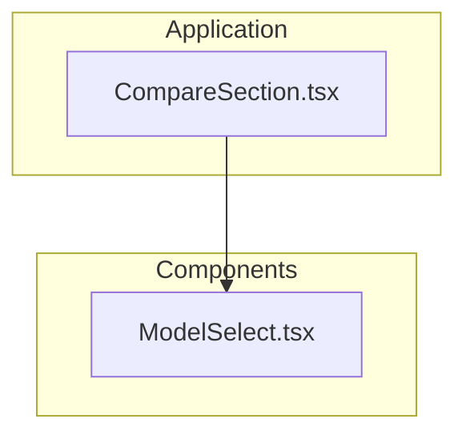
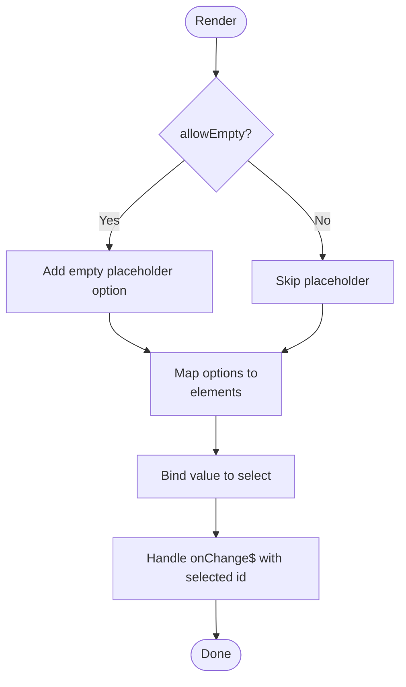
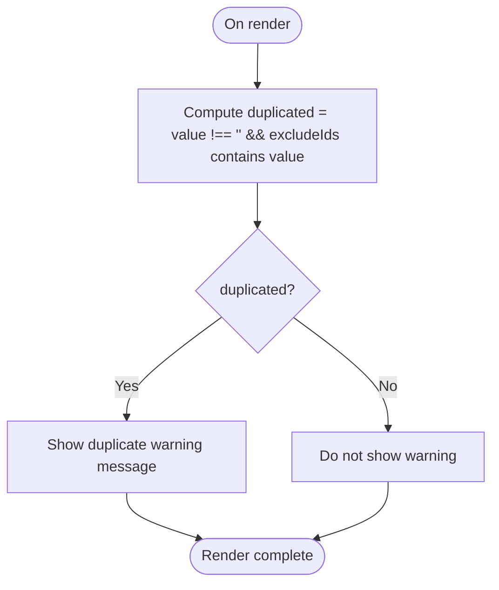
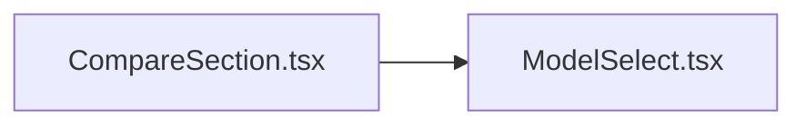

# ModelSelect Input Component

<cite>
**Referenced Files in This Document**
- [ModelSelect.tsx](file://src/components/ModelSelect.tsx)
- [CompareSection.tsx](file://src/components/CompareSection.tsx)
</cite>

## Table of Contents
1. [Introduction](#introduction)
2. [Project Structure](#project-structure)
3. [Core Components](#core-components)
4. [Architecture Overview](#architecture-overview)
5. [Detailed Component Analysis](#detailed-component-analysis)
6. [Dependency Analysis](#dependency-analysis)
7. [Performance Considerations](#performance-considerations)
8. [Troubleshooting Guide](#troubleshooting-guide)
9. [Conclusion](#conclusion)

## Introduction
The ModelSelect component is a controlled dropdown selector used to choose models and result sources within the application. It renders a native select element, supports an optional empty placeholder option, validates duplicate selections across multiple slots, and emits change events through a Qwik callback. It is styled with Tailwind CSS classes and integrates directly with form controls via standard label/select semantics.

## Project Structure
ModelSelect lives under the components directory and is consumed by CompareSection, which provides model selection slots and a results source selector.

**Diagram sources**
- [CompareSection.tsx:5-121](file://src/components/CompareSection.tsx#L5-L121)
- [ModelSelect.tsx:20-47](file://src/components/ModelSelect.tsx#L20-L47)

**Section sources**
- [ModelSelect.tsx:1-48](file://src/components/ModelSelect.tsx#L1-L48)
- [CompareSection.tsx:1-121](file://src/components/CompareSection.tsx#L1-L121)

## Core Components
- ModelSelect: A Qwik component that renders a labeled select dropdown with validation feedback for duplicate selections.
- CompareSection: The parent component that uses ModelSelect for three model slots and one results source selector.

Key responsibilities:
- Render accessible labels and selects.
- Provide an optional “— Choose —” placeholder.
- Validate and warn when a selected value appears in other slots.
- Emit change events to parent state handlers.

**Section sources**
- [ModelSelect.tsx:9-47](file://src/components/ModelSelect.tsx#L9-L47)
- [CompareSection.tsx:88-121](file://src/components/CompareSection.tsx#L88-L121)

## Architecture Overview
ModelSelect is a presentational, controlled component. Parent components supply options and handle changes. Validation logic is minimal and local to the component (duplicate detection), while styling is fully delegated to Tailwind utility classes.

```mermaid
sequenceDiagram
participant Parent as "CompareSection.tsx"
participant Select as "ModelSelect.tsx"
participant DOM as "HTMLSelectElement"
Parent->>Select : render with props (label, selectId, value, options, excludeIds, allowEmpty, onChange$)
Select->>DOM : create <select> with options and placeholder
DOM-->>Select : onChange event
Select->>Parent : invoke onChange$(id)
Parent->>Parent : update state and re-render
```

**Diagram sources**
- [CompareSection.tsx:94-102](file://src/components/CompareSection.tsx#L94-L102)
- [CompareSection.tsx:113-121](file://src/components/CompareSection.tsx#L113-L121)
- [ModelSelect.tsx:28-32](file://src/components/ModelSelect.tsx#L28-L32)

## Detailed Component Analysis

### Props Interface
| Prop | Type | Required | Default | Description |
|---|---|---:|---:|---|
| label | string | Yes | — | Accessible label text for the select control. |
| selectId | string | Yes | — | Unique id for the select element; linked to the label. |
| value | string | Yes | — | Controlled value bound to the select’s current selection. |
| options | ModelOption[] | Yes | — | Array of selectable items with id and name. |
| excludeIds | string[] | Yes | — | List of ids to treat as duplicates for validation feedback. |
| allowEmpty | boolean | No | true | When true, renders an empty placeholder option “— Choose —”. |
| onChange$ | QRL<(id: string) => void> | Yes | — | Callback invoked with the newly selected id. |

Data type:
- ModelOption: { id: string; name: string }

**Section sources**
- [ModelSelect.tsx:4-18](file://src/components/ModelSelect.tsx#L4-L18)

### Dropdown Behavior
- Renders a native HTML select element.
- If allowEmpty is true, includes an empty placeholder option at the top.
- Maps options to option elements keyed by option.id.
- Binds the select’s value to the controlled value prop.
- Emits onChange$ with the selected id on change.

**Diagram sources**
- [ModelSelect.tsx:28-39](file://src/components/ModelSelect.tsx#L28-L39)

**Section sources**
- [ModelSelect.tsx:20-47](file://src/components/ModelSelect.tsx#L20-L47)

### Filtering Capabilities
- The component does not implement client-side filtering or search.
- Filtering should be performed by the parent before passing options to ModelSelect.

[No sources needed since this section describes absence of functionality]

### Option Validation Logic
- Duplicate detection: if the current value exists in excludeIds, a warning message is shown beneath the select.
- This is intended to prevent selecting the same model in multiple slots.

**Diagram sources**
- [ModelSelect.tsx:22-43](file://src/components/ModelSelect.tsx#L22-L43)

**Section sources**
- [ModelSelect.tsx:22-43](file://src/components/ModelSelect.tsx#L22-L43)

### Accessibility Features
- Label association: The label uses a for attribute matching the select id, ensuring proper association for screen readers.
- Native semantics: Using a native select ensures built-in keyboard navigation (arrow keys, Enter/Space) and screen reader support.
- ARIA attributes: The component does not add additional ARIA roles or attributes beyond the native semantics.

Recommendations for enhanced accessibility:
- Add aria-invalid and aria-describedby when validation messages are shown.
- Provide aria-live regions for dynamic validation feedback.
- Ensure focus management if customizing behavior.

**Section sources**
- [ModelSelect.tsx:25-32](file://src/components/ModelSelect.tsx#L25-L32)

### Styling System
- Styled entirely with Tailwind utility classes.
- Includes light/dark mode variants for borders, backgrounds, text, and focus rings.
- Focus states use indigo colors for visibility and contrast.

Styling highlights:
- Container spacing and typography for label.
- Select width, border radius, padding, and transition effects.
- Dark mode overrides for background and text color.
- Warning message color adapts to dark mode.

**Section sources**
- [ModelSelect.tsx:25-43](file://src/components/ModelSelect.tsx#L25-L43)

### Custom Option Rendering
- Options are rendered using simple text from option.name.
- There is no custom renderer function or slot for richer option content.

If customization is required:
- Introduce a renderOption prop or slot to accept a function returning JSX per option.
- Keep accessibility considerations in mind (e.g., aria-selected for custom lists).

[No sources needed since this section proposes future enhancements]

### Integration with Form Controls
- Works as a controlled input bound to value and onChange$.
- Integrates naturally with forms by pairing label and select elements.
- For advanced form libraries, wrap the select with appropriate field bindings and validation hooks.

**Section sources**
- [ModelSelect.tsx:25-32](file://src/components/ModelSelect.tsx#L25-L32)

### Usage Patterns and Examples

#### Basic Model Selection
- Provide label, selectId, value, options, excludeIds, and onChange$.
- Use allowEmpty=true to require explicit user choice.

Example usage context:
- Three model slots in CompareSection pass unique excludeIds to prevent duplicates.

**Section sources**
- [CompareSection.tsx:88-104](file://src/components/CompareSection.tsx#L88-L104)
- [ModelSelect.tsx:20-47](file://src/components/ModelSelect.tsx#L20-L47)

#### Results Source Selector
- Set allowEmpty=false to ensure a valid source is always selected.
- Pass curated SOURCES list mapped to { id, name }.

Example usage context:
- Results source selector in CompareSection sets allowEmpty=false and passes SOURCES.

**Section sources**
- [CompareSection.tsx:113-121](file://src/components/CompareSection.tsx#L113-L121)
- [ModelSelect.tsx:15-17](file://src/components/ModelSelect.tsx#L15-L17)

#### Validation Scenarios
- Duplicate selection: When a selected id appears in excludeIds, a warning is displayed.
- Empty selection: With allowEmpty=true, users can clear the selection to the placeholder.

**Section sources**
- [ModelSelect.tsx:22-43](file://src/components/ModelSelect.tsx#L22-L43)

#### Event Handling
- onChange$ receives the selected id string.
- Parent components update their state and propagate new props down.

**Section sources**
- [ModelSelect.tsx:31-32](file://src/components/ModelSelect.tsx#L31-L32)
- [CompareSection.tsx:94-102](file://src/components/CompareSection.tsx#L94-L102)

## Dependency Analysis
ModelSelect has no internal dependencies beyond Qwik primitives and types. CompareSection imports and renders ModelSelect.

**Diagram sources**
- [CompareSection.tsx:5](file://src/components/CompareSection.tsx#L5)
- [ModelSelect.tsx:1-2](file://src/components/ModelSelect.tsx#L1-L2)

**Section sources**
- [CompareSection.tsx:1-6](file://src/components/CompareSection.tsx#L1-L6)
- [ModelSelect.tsx:1-3](file://src/components/ModelSelect.tsx#L1-L3)

## Performance Considerations
- Rendering cost: Since ModelSelect maps options to option elements, rendering time scales linearly with the number of options.
- Large option lists:
  - Pre-filter and sort options in the parent component before passing them to ModelSelect.
  - Consider virtualization or pagination if the option list grows significantly.
- Memory management:
  - Avoid creating new option arrays on every render; memoize options where possible.
  - Ensure stable option ids to minimize re-renders.
- Change handling:
  - Keep onChange$ lightweight; avoid heavy computations inside the callback.

[No sources needed since this section provides general guidance]

## Troubleshooting Guide
- Duplicate warning appears unexpectedly:
  - Verify excludeIds includes all other selected values.
  - Ensure value is correctly bound and not stale.
- Placeholder not visible:
  - Confirm allowEmpty is true.
- Screen reader not announcing label:
  - Ensure selectId matches label for attribute.
- Styling issues:
  - Tailwind classes are applied; verify build configuration and dark mode settings.

**Section sources**
- [ModelSelect.tsx:22-43](file://src/components/ModelSelect.tsx#L22-L43)
- [ModelSelect.tsx:25-32](file://src/components/ModelSelect.tsx#L25-L32)

## Conclusion
ModelSelect is a focused, accessible, and styled dropdown component designed for controlled selection of models and result sources. It provides straightforward validation feedback for duplicate selections and integrates cleanly with parent components through props and callbacks. For large datasets, perform filtering and memoization at the parent level to maintain performance. Accessibility is grounded in native semantics, with opportunities to enhance it further based on application needs.