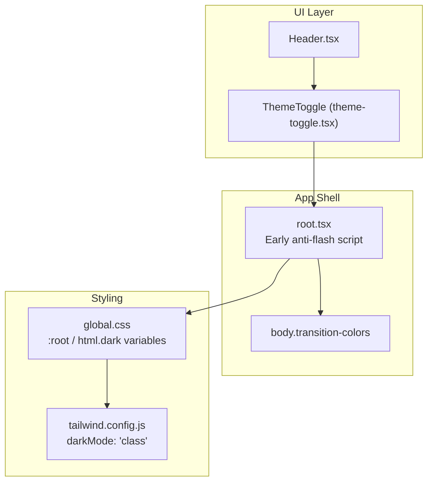
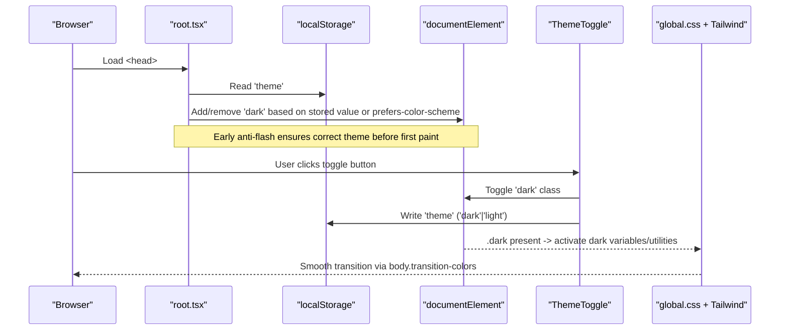
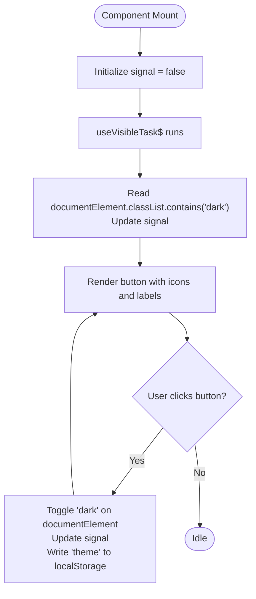
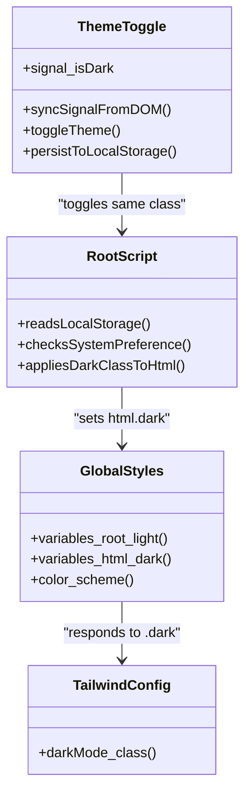
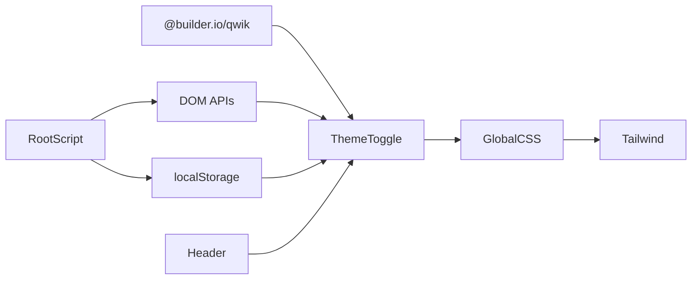

# Theme Toggle Component

<cite>
**Referenced Files in This Document**
- [theme-toggle.tsx](file://src/components/theme-toggle/theme-toggle.tsx)
- [Header.tsx](file://src/components/Header.tsx)
- [root.tsx](file://src/root.tsx)
- [global.css](file://src/global.css)
- [tailwind.config.js](file://tailwind.config.js)
</cite>

## Table of Contents
1. [Introduction](#introduction)
2. [Project Structure](#project-structure)
3. [Core Components](#core-components)
4. [Architecture Overview](#architecture-overview)
5. [Detailed Component Analysis](#detailed-component-analysis)
6. [Dependency Analysis](#dependency-analysis)
7. [Performance Considerations](#performance-considerations)
8. [Troubleshooting Guide](#troubleshooting-guide)
9. [Conclusion](#conclusion)

## Introduction
This document explains the theme toggle component that enables dark/light theme switching across the application. It covers state management, persistence with local storage, system preference detection, CSS class toggling on the root element, Tailwind CSS dark mode integration, accessibility features, and best practices for performance and user experience.

## Project Structure
The theme toggle is implemented as a small Qwik component and integrated into the site header. The global theme behavior is coordinated by an early script in the app root and CSS variables scoped to the root element.

**Diagram sources**
- [root.tsx:18-32](file://src/root.tsx#L18-L32)
- [theme-toggle.tsx:10-34](file://src/components/theme-toggle/theme-toggle.tsx#L10-L34)
- [global.css:13-34](file://src/global.css#L13-L34)
- [tailwind.config.js:1-4](file://tailwind.config.js#L1-L4)

**Section sources**
- [theme-toggle.tsx:1-78](file://src/components/theme-toggle/theme-toggle.tsx#L1-L78)
- [Header.tsx:1-14](file://src/components/Header.tsx#L1-L14)
- [root.tsx:18-32](file://src/root.tsx#L18-L32)
- [global.css:13-34](file://src/global.css#L13-L34)
- [tailwind.config.js:1-4](file://tailwind.config.js#L1-L4)

## Core Components
- ThemeToggle: A Qwik component that renders a button to switch between light and dark themes. It updates the `dark` class on the document root and persists the choice to local storage.
- Header: Integrates the ThemeToggle into the page header.
- App Root: Runs an inline script before paint to apply the correct theme based on local storage or system preference.
- Global Styles: Define CSS variables for light and dark modes and set `color-scheme` for native UI controls.
- Tailwind Configuration: Enables class-based dark mode so Tailwind’s `dark:` utilities respond to the presence of `.dark` on the root element.

**Section sources**
- [theme-toggle.tsx:1-78](file://src/components/theme-toggle/theme-toggle.tsx#L1-L78)
- [Header.tsx:1-14](file://src/components/Header.tsx#L1-L14)
- [root.tsx:18-32](file://src/root.tsx#L18-L32)
- [global.css:13-34](file://src/global.css#L13-L34)
- [tailwind.config.js:1-4](file://tailwind.config.js#L1-L4)

## Architecture Overview
The theme system follows a simple, robust pattern:
- The app root applies the initial theme synchronously using an inline script that reads local storage and/or system preference.
- The ThemeToggle component toggles the `dark` class on the document root (`<html>`).
- Tailwind’s `dark:` utilities and CSS variables react to the presence of `.dark` on the root.
- The body uses CSS transitions for smooth color changes.

**Diagram sources**
- [root.tsx:18-32](file://src/root.tsx#L18-L32)
- [theme-toggle.tsx:10-34](file://src/components/theme-toggle/theme-toggle.tsx#L10-L34)
- [global.css:13-34](file://src/global.css#L13-L34)
- [tailwind.config.js:1-4](file://tailwind.config.js#L1-L4)

## Detailed Component Analysis

### ThemeToggle Component
Responsibilities:
- Maintain internal UI state for whether dark mode is active.
- Synchronize UI state with the actual DOM state on first render.
- Toggle the `dark` class on the document root when the user interacts with the button.
- Persist the selected theme to local storage.
- Provide accessible markup and dynamic tooltips.

State Management
- Uses a reactive signal to track whether dark mode is active.
- On first visible render, reads the current `dark` class from the document root to initialize the signal accurately.

Persistence
- Writes the chosen theme to local storage under a specific key whenever the user toggles.
- Wraps writes in error handling to avoid failures in restricted environments.

System Preference Detection
- Not handled inside this component; instead, the app root script applies the system preference at startup if no explicit user preference exists.

Accessibility
- Button has an appropriate label for screen readers.
- Dynamic tooltip text indicates the action (“Switch to Light Mode” vs “Switch to Dark Mode”).
- Focus styles are provided via utility classes.

Visual Feedback
- Displays a sun icon when dark mode is active and a moon icon otherwise.
- Icon colors adapt to the current theme using Tailwind utilities.

**Diagram sources**
- [theme-toggle.tsx:3-8](file://src/components/theme-toggle/theme-toggle.tsx#L3-L8)
- [theme-toggle.tsx:10-34](file://src/components/theme-toggle/theme-toggle.tsx#L10-L34)
- [theme-toggle.tsx:36-77](file://src/components/theme-toggle/theme-toggle.tsx#L36-L77)

**Section sources**
- [theme-toggle.tsx:1-78](file://src/components/theme-toggle/theme-toggle.tsx#L1-L78)

### Integration With Header
- The ThemeToggle is placed in the left section of the header, making it easily accessible.
- The header itself uses Tailwind utilities that respond to the `dark` class, ensuring consistent styling.

Usage Example
- Import and render `<ThemeToggle />` within the header layout.

**Section sources**
- [Header.tsx:1-14](file://src/components/Header.tsx#L1-L14)

### Global Theme System
Initialization Script
- Runs synchronously in the document head before the first paint.
- Reads the stored theme from local storage.
- If no stored preference exists, checks the browser’s system preference using a media query.
- Adds or removes the `dark` class on the document root accordingly.

CSS Variables and Transitions
- Defines CSS variables for background and text colors under `:root` (light defaults) and overrides them under `html.dark` (dark overrides).
- Sets `color-scheme` to inform native UI controls about the active theme.
- Applies a transition on the body for smooth color changes.

Tailwind Dark Mode
- Configured to use class-based dark mode, which means Tailwind’s `dark:` utilities only activate when the root element has the `dark` class.

**Diagram sources**
- [root.tsx:18-32](file://src/root.tsx#L18-L32)
- [theme-toggle.tsx:10-34](file://src/components/theme-toggle/theme-toggle.tsx#L10-L34)
- [global.css:13-34](file://src/global.css#L13-L34)
- [tailwind.config.js:1-4](file://tailwind.config.js#L1-L4)

**Section sources**
- [root.tsx:18-32](file://src/root.tsx#L18-L32)
- [global.css:13-34](file://src/global.css#L13-L34)
- [tailwind.config.js:1-4](file://tailwind.config.js#L1-L4)

## Dependency Analysis
- ThemeToggle depends on:
  - Qwik primitives for signals and tasks.
  - DOM APIs to read/write the `dark` class on the document root.
  - Local storage API for persistence.
- Header depends on ThemeToggle for rendering the control.
- App root depends on local storage and system preference APIs to initialize the theme before paint.
- Styling depends on Tailwind’s class-based dark mode and CSS variables defined globally.

**Diagram sources**
- [theme-toggle.tsx:1-34](file://src/components/theme-toggle/theme-toggle.tsx#L1-L34)
- [root.tsx:18-32](file://src/root.tsx#L18-L32)
- [global.css:13-34](file://src/global.css#L13-L34)
- [tailwind.config.js:1-4](file://tailwind.config.js#L1-L4)

**Section sources**
- [theme-toggle.tsx:1-34](file://src/components/theme-toggle/theme-toggle.tsx#L1-L34)
- [root.tsx:18-32](file://src/root.tsx#L18-L32)
- [global.css:13-34](file://src/global.css#L13-L34)
- [tailwind.config.js:1-4](file://tailwind.config.js#L1-L4)

## Performance Considerations
- Anti-flash script runs synchronously in the head to prevent a flash of incorrect theme on first load.
- Only the root element’s class is toggled; descendant elements inherit styles via CSS cascade and Tailwind utilities, minimizing reflows.
- CSS transitions on the body provide smooth visual changes without heavy animations.
- Local storage writes are wrapped in error handling to avoid blocking interactions in restrictive environments.

[No sources needed since this section provides general guidance]

## Troubleshooting Guide
Common issues and resolutions:
- Theme does not persist:
  - Verify local storage is available and not blocked by privacy settings.
  - Ensure the write path is not throwing errors; the implementation includes try/catch around storage operations.
- Initial theme appears wrong briefly:
  - Confirm the inline script in the app root is present and executes before paint.
  - Check that Tailwind’s dark mode is set to class-based.
- Icons or colors do not update:
  - Ensure the `dark` class is being added/removed on the document root.
  - Verify CSS variables and Tailwind utilities are correctly scoped to `:root` and `html.dark`.

**Section sources**
- [theme-toggle.tsx:21-33](file://src/components/theme-toggle/theme-toggle.tsx#L21-L33)
- [root.tsx:18-32](file://src/root.tsx#L18-L32)
- [tailwind.config.js:1-4](file://tailwind.config.js#L1-L4)
- [global.css:13-34](file://src/global.css#L13-L34)

## Conclusion
The theme toggle component provides a minimal, robust mechanism for switching between light and dark themes. It integrates cleanly with Qwik’s reactive model, persists user preferences, respects system preferences, and leverages Tailwind’s class-based dark mode alongside CSS variables for consistent styling. The approach prioritizes performance, accessibility, and maintainability while offering a smooth user experience.

[No sources needed since this section summarizes without analyzing specific files]