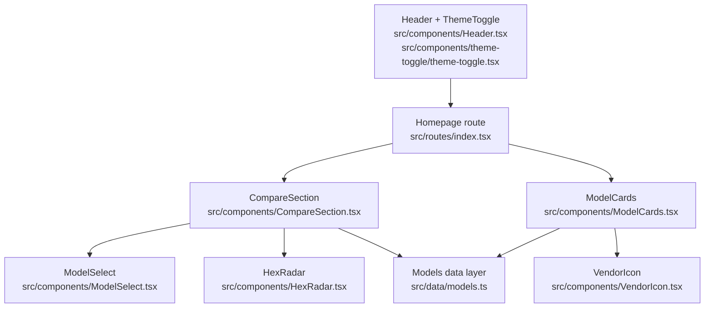
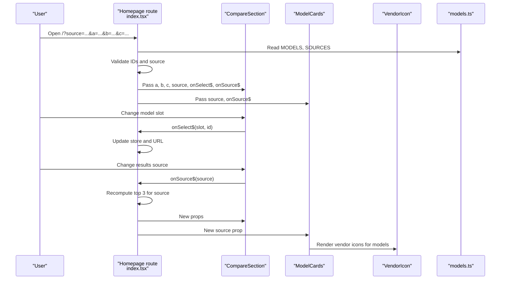
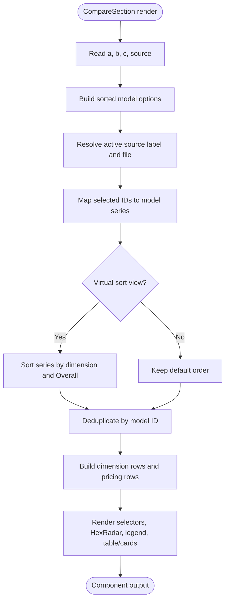
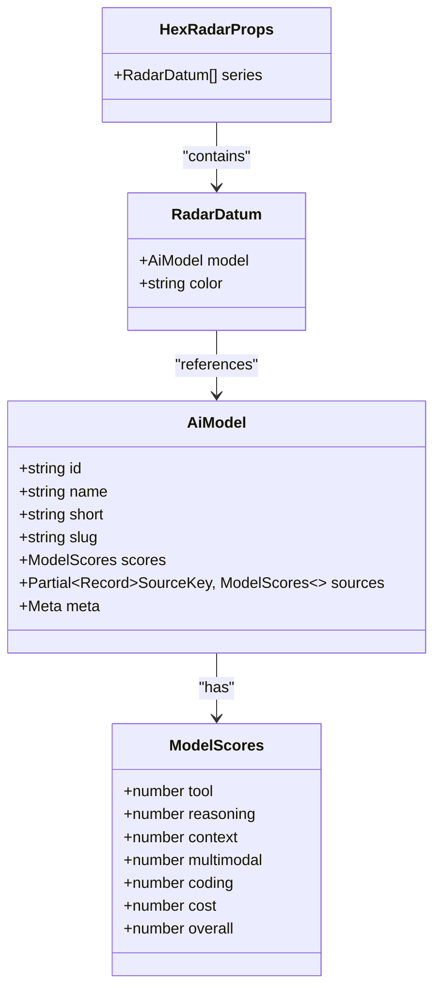
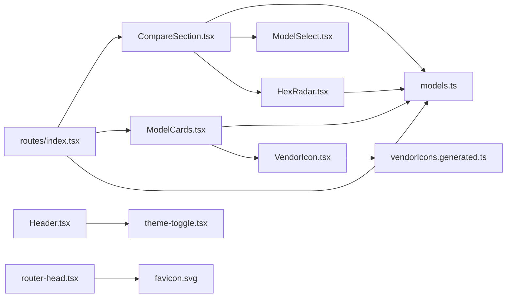

# User Interface Components

<cite>
**Referenced Files in This Document**   
- [CompareSection.tsx](file://src/components/CompareSection.tsx)
- [HexRadar.tsx](file://src/components/HexRadar.tsx)
- [ModelCards.tsx](file://src/components/ModelCards.tsx)
- [ModelSelect.tsx](file://src/components/ModelSelect.tsx)
- [VendorIcon.tsx](file://src/components/VendorIcon.tsx)
- [index.tsx](file://src/routes/index.tsx)
- [models.ts](file://src/data/models.ts)
- [Header.tsx](file://src/components/Header.tsx)
- [theme-toggle.tsx](file://src/components/theme-toggle/theme-toggle.tsx)
- [router-head.tsx](file://src/components/router-head.tsx)
- [tailwind.config.js](file://tailwind.config.js)
- [README.md](file://README.md)
</cite>

## Update Summary
**Changes Made**   
- Added new VendorIcon component documentation section
- Updated ModelCards component to include VendorIcon usage
- Enhanced architecture diagram to show VendorIcon integration
- Updated dependency analysis to reflect VendorIcon relationships
- Added vendor icon performance and reliability improvements

## Table of Contents
1. [Introduction](#introduction)
2. [Project Structure](#project-structure)
3. [Core Components](#core-components)
4. [Architecture Overview](#architecture-overview)
5. [Detailed Component Analysis](#detailed-component-analysis)
6. [Dependency Analysis](#dependency-analysis)
7. [Performance Considerations](#performance-considerations)
8. [Troubleshooting Guide](#troubleshooting-guide)
9. [Conclusion](#conclusion)

## Introduction
This document describes the ModelComp user interface components that power the AI model comparison experience. The main orchestrator is `CompareSection`, which coordinates three model slots, a results-source selector, an interactive hexagonal radar chart (`HexRadar`), and a data table with mobile-friendly cards. `ModelCards` presents all models in card or list view with sorting controls, while `ModelSelect` provides reusable dropdown selection for both model slots and results sources.

The site compares models across six normalized dimensions: Tool use, Reasoning, Context window, Multimodal, Coding, and Cost efficiency. Scores are pre-parsed at build time from research files into generated data modules, so the UI reads typed model objects rather than raw markdown.

**Section sources**
- [README.md:1-16](file://README.md#L1-L16)
- [README.md:31-44](file://README.md#L31-L44)
- [README.md:46-59](file://README.md#L46-L59)

## Project Structure
The relevant UI code lives under `src/components` and is consumed by the homepage route. Data comes from `src/data/models.ts`, which hydrates model metadata and scores from generated files.

**Diagram sources**
- [index.tsx:103-179](file://src/routes/index.tsx#L103-L179)
- [CompareSection.tsx:20-119](file://src/components/CompareSection.tsx#L20-L119)
- [ModelCards.tsx:13-28](file://src/components/ModelCards.tsx#L13-L28)
- [HexRadar.tsx:62-166](file://src/components/HexRadar.tsx#L62-L166)
- [models.ts:227-333](file://src/data/models.ts#L227-L333)

**Section sources**
- [README.md:61-72](file://README.md#L61-L72)
- [index.tsx:103-179](file://src/routes/index.tsx#L103-L179)

## Core Components
| Component | Responsibility | Main props | Key behavior |
|---|---|---|---|
| `CompareSection` | Orchestrates A/B/C model comparison, results source, radar chart, legend, and exact-score table/cards | `a`, `b`, `c`, `source`, `onSelect$`, `onSource$` | Builds series from selected models, handles virtual sort views, deduplicates identical models, renders HexRadar and responsive tables |
| `HexRadar` | Renders the SVG hexagonal radar chart | `series` | Draws grid rings, axes, dimension labels, filled polygons per model, and tooltip dots |
| `ModelCards` | Displays all models in cards or list view | `source`, `onSource$` | Filters/sorts by current results source, supports pagination, sortable headers, and mobile filter buttons |
| `ModelSelect` | Reusable dropdown for model or source selection | `label`, `selectId`, `value`, `options`, `excludeIds`, `allowEmpty`, `onChange$` | Validates duplicates, supports optional empty option, emits change events |
| `VendorIcon` | Renders local inline SVG vendor marks for model providers | `id`, `name`, `size` | Matches vendor names to inline SVGs, provides fallback glyphs, supports chip styling and theme adaptation |
| `Header` | Sticky header, desktop navigation, mobile drawer menu, theme toggle entry point | None | Toggles mobile drawer state; embeds `ThemeToggle` |
| `ThemeToggle` | Dark/light mode toggle | None | Reads/writes `html.dark`, persists preference to `localStorage` |

**Section sources**
- [CompareSection.tsx:9-16](file://src/components/CompareSection.tsx#L9-L16)
- [HexRadar.tsx:5-12](file://src/components/HexRadar.tsx#L5-L12)
- [ModelCards.tsx:6-9](file://src/components/ModelCards.tsx#L6-L9)
- [ModelSelect.tsx:4-18](file://src/components/ModelSelect.tsx#L4-L18)
- [VendorIcon.tsx:4-9](file://src/components/VendorIcon.tsx#L4-L9)
- [Header.tsx:4-7](file://src/components/Header.tsx#L4-L7)
- [theme-toggle.tsx:3-4](file://src/components/theme-toggle/theme-toggle.tsx#L3-L4)

## Architecture Overview
The homepage route owns global selection state and URL synchronization. It passes model slot values and the active results source down to `CompareSection` and `ModelCards`. Both components read model data from `models.ts`, but only the route mutates shared state and updates the URL.

**Diagram sources**
- [index.tsx:103-179](file://src/routes/index.tsx#L103-L179)
- [CompareSection.tsx:20-121](file://src/components/CompareSection.tsx#L20-L121)
- [ModelCards.tsx:13-28](file://src/components/ModelCards.tsx#L13-L28)
- [models.ts:227-329](file://src/data/models.ts#L227-L329)

## Detailed Component Analysis

### CompareSection
`CompareSection` is the central orchestration component for the comparison view. It receives three model slot identifiers and the active results source, then builds a deduplicated series of models for rendering.

Key responsibilities:
- Build sorted model options for A/B/C selectors.
- Resolve the active source label, file, and contributor summary.
- Map selected model IDs to model objects and their scores for the active source.
- Handle virtual sort views where the same average numbers are ranked by one dimension.
- Deduplicate identical models so the same model cannot appear twice in the chart.
- Prepare rows for the exact-scores table and pricing display.
- Render `ModelSelect` for each slot and for the results source.
- Render `HexRadar` with computed series.
- Provide a desktop table and mobile card layout for exact scores.

Props:
| Prop | Type | Description |
|---|---|---|
| `a` | `string` | Selected model ID for slot A |
| `b` | `string` | Selected model ID for slot B |
| `c` | `string` | Selected model ID for slot C |
| `source` | `ResultsView` | Active results source: average, virtual dimension view, or reporting agent |
| `onSelect$` | QRL callback | Called when a model slot changes; receives slot name and model ID |
| `onSource$` | QRL callback | Called when the results source changes; receives new source key |

State management:
- Local arrays and maps are derived from props; no persistent local state is needed.
- Duplicate detection uses a `Map` keyed by model ID, preferring entries with valid data.
- Virtual sort views reorder the series by the target dimension and Overall tiebreaker.

Interaction patterns:
- Model selectors exclude other selected models to prevent accidental duplication.
- Results source selector always has a value; it does not allow empty selection.
- Legend items link to per-model pages and show Overall score plus Free/Paid badge.
- Exact-score table shows dimension values, context window, and pricing tiers.

Accessibility:
- Section has an `id` and `aria-labelledby`.
- Table headers use `scope="col"` and `scope="row"`.
- Mobile card layout includes `aria-label` for screen readers.
- Pricing badges use `cursor-help` and `title` for tooltips.

Responsive design:
- Three-column grid on medium screens for selectors.
- Two-column layout on large screens for radar and sidebar.
- Desktop-only wide table; mobile-only stacked cards.

Customization options:
- Series colors come from `MODEL_COLORS`.
- Dimensions and labels come from `DIMENSIONS`.
- Source ordering and labels come from `SOURCES`.

Error handling:
- Missing or invalid model IDs produce undefined series items that are filtered out.
- Missing source scores fall back to average scores with an N/A visual indicator.

**Section sources**
- [CompareSection.tsx:9-16](file://src/components/CompareSection.tsx#L9-L16)
- [CompareSection.tsx:20-76](file://src/components/CompareSection.tsx#L20-L76)
- [CompareSection.tsx:78-175](file://src/components/CompareSection.tsx#L78-L175)
- [CompareSection.tsx:177-315](file://src/components/CompareSection.tsx#L177-L315)

#### CompareSection Flowchart

**Diagram sources**
- [CompareSection.tsx:20-76](file://src/components/CompareSection.tsx#L20-L76)
- [CompareSection.tsx:78-175](file://src/components/CompareSection.tsx#L78-L175)

### HexRadar
`HexRadar` renders an SVG-based hexagonal radar chart comparing up to three models across six dimensions.

Props:
| Prop | Type | Description |
|---|---|---|
| `series` | `RadarDatum[]` | Array of model entries with `model` and `color` |

Data model:
| Field | Type | Description |
|---|---|---|
| `model` | `AiModel` | Hydrated model object with scores and metadata |
| `color` | `string` | Series color assigned by `CompareSection` |

Chart geometry:
- Center is fixed at `(200, 200)` inside a `400x400` viewBox.
- Maximum radius is `130`; axis labels are placed at radius `168`.
- Six axes correspond to `DIMENSIONS`: Tool use, Reasoning, Context window, Multimodal, Coding, Cost efficiency.
- Grid rings are drawn at 25, 50, 75, and 100.

Non-linear scaling:
- Values are scaled using a power curve so the outer half of each axis represents 75–100.
- This emphasizes differences among high-scoring models without creating sharp kinks.

Rendering steps:
1. Draw concentric hexagon rings.
2. Draw axis lines from center to maximum radius.
3. For each series, compute polar points from model scores and draw a filled polygon.
4. Draw a dot per dimension per series.
5. Place dimension labels around the outside.
6. Add titles and descriptions for accessibility.

Accessibility:
- SVG has `role="img"`.
- Title and description describe the chart purpose and axes.
- Each dot has a tooltip title showing model name, dimension, and contextual information.

Mobile behavior:
- The SVG scales via Tailwind classes and viewBox; no separate mobile implementation is required.

Customization:
- Colors are provided externally through `series.color`.
- Dimension definitions come from `DIMENSIONS`.
- Tooltip text adapts special cases for cost, context, multimodal, and promotional free-tier notes.

**Section sources**
- [HexRadar.tsx:5-12](file://src/components/HexRadar.tsx#L5-L12)
- [HexRadar.tsx:14-33](file://src/components/HexRadar.tsx#L14-L33)
- [HexRadar.tsx:35-60](file://src/components/HexRadar.tsx#L35-L60)
- [HexRadar.tsx:62-166](file://src/components/HexRadar.tsx#L62-L166)

#### HexRadar Class Diagram

**Diagram sources**
- [HexRadar.tsx:5-12](file://src/components/HexRadar.tsx#L5-L12)
- [models.ts:46-77](file://src/data/models.ts#L46-L77)

### ModelCards
`ModelCards` displays every available model in either card or list view. It respects the active results source and supports sorting by dimension or Overall.

Props:
| Prop | Type | Description |
|---|---|---|
| `source` | `ResultsView` | Active results source used for filtering and ranking |
| `onSource$` | QRL callback | Called when a user sorts by a dimension or Overall |

Local state:
- `displayCount`: Controls how many models are shown before "Show more".
- `view`: Switches between card and list layouts.

Filtering and sorting:
- Models are filtered to include those present in the active source.
- Virtual sort views rank by the chosen dimension; otherwise models are ranked by Overall.
- Pagination starts at nine models and increases by nine.

Card view:
- Shows model name, Overall badge, Free/Paid status, short description, context, modalities, pricing note, and inline dimension scores.
- Uses `VendorIcon` to display provider logos alongside model names.

List view:
- Desktop table with sortable column headers.
- Mobile filter buttons for each dimension and Overall.
- Stacked card layout for mobile exact scores.
- Includes `VendorIcon` in table rows for consistent branding.

Accessibility:
- Section has `aria-labelledby`.
- View switcher uses `role="group"` and `aria-pressed`.
- Table headers expose `aria-sort` and `aria-label`.
- Mobile filter group uses `role="group"` and `aria-label`.

Responsive design:
- Card grid switches from one to two to three columns.
- List table is hidden on small screens; mobile filters and cards replace it.

Customization:
- Sorting keys are derived from `sortSourceFor`.
- Dimension labels and descriptions come from `DIMENSIONS`.
- Source ordering comes from `SOURCES`.

**Section sources**
- [ModelCards.tsx:6-9](file://src/components/ModelCards.tsx#L6-L9)
- [ModelCards.tsx:13-28](file://src/components/ModelCards.tsx#L13-L28)
- [ModelCards.tsx:30-74](file://src/components/ModelCards.tsx#L30-L74)
- [ModelCards.tsx:75-125](file://src/components/ModelCards.tsx#L75-L125)
- [ModelCards.tsx:126-367](file://src/components/ModelCards.tsx#L126-L367)

### ModelSelect
`ModelSelect` is a lightweight, accessible select component used for model slots and results sources.

Props:
| Prop | Type | Default | Description |
|---|---|---|---|
| `label` | `string` | Required | Accessible label for the select |
| `selectId` | `string` | Required | HTML `id` for the `<select>` element |
| `value` | `string` | Required | Current selected value |
| `options` | `ModelOption[]` | Required | Dropdown options with `id` and `name` |
| `excludeIds` | `string[]` | Required | IDs excluded from this selector to prevent duplicate selections |
| `allowEmpty` | `boolean` | `true` | Whether to show an empty "Choose" option |
| `onChange$` | QRL callback | Required | Emits the selected ID |

Behavior:
- If the selected value appears in another slot, a warning message is displayed.
- Empty option is conditionally rendered based on `allowEmpty`.
- Styling uses Tailwind utilities for light and dark modes.

Accessibility:
- Label is associated with the select via `for` and `id`.
- Focus ring styles are included for keyboard navigation.

**Section sources**
- [ModelSelect.tsx:4-18](file://src/components/ModelSelect.tsx#L4-L18)
- [ModelSelect.tsx:20-47](file://src/components/ModelSelect.tsx#L20-L47)

### VendorIcon
`VendorIcon` renders local inline SVG vendor marks for AI model providers, replacing external Google favicon dependencies with self-contained brand logos. This improves performance and reliability across all supported providers.

Props:
| Prop | Type | Default | Description |
|---|---|---|---|
| `id` | `string` | Required | Model identifier used for vendor matching |
| `name` | `string` | Required | Model name used for vendor matching |
| `size` | `"sm" \| "lg"` | `"sm"` | Icon size: "sm" (20px for lists/cards) or "lg" (matches page headings) |

Vendor matching logic:
- Token-prefix matching over `${id} ${name}` lowercase strings.
- Supports 20+ major AI providers including Anthropic, OpenAI, Google, xAI, Zhipu, DeepSeek, Xiaomi, Qwen, Moonshot AI, MiniMax, Meta, NVIDIA, Mistral, Upstage, ByteDance, Tencent, Meituan, Ant Group.
- Fallback to generic hexagonal glyph with first letter for unknown vendors.

Visual variants:
- **Chip style**: Dark background with white logo for brands requiring contrast (Anthropic).
- **Adaptive style**: Theme-aware colors that adapt to light/dark mode.
- **Invert style**: White logos that invert appropriately for different backgrounds.
- **Brand color**: Custom color application for specific vendors like Xiaomi.

Rendering behavior:
- Imports inline SVGs from generated data module (`vendorIcons.generated`).
- No network requests or external image loading.
- Responsive sizing with Tailwind CSS classes.
- Accessibility attributes including `role="img"` and `aria-label`.

Accessibility:
- All vendor icons have proper `role="img"` and descriptive `aria-label`.
- Unknown vendors show "Unknown vendor" with appropriate fallback.
- Screen reader friendly with semantic SVG structure.

Performance benefits:
- Eliminates external network requests for vendor logos.
- Reduces bundle size compared to external image dependencies.
- Improves reliability by removing dependency on third-party services.
- Enables better caching and offline support.

**Section sources**
- [VendorIcon.tsx:1-124](file://src/components/VendorIcon.tsx#L1-L124)

### Homepage Route Integration
The homepage route initializes default model selections, validates query parameters, synchronizes state with the URL, and composes the UI.

Responsibilities:
- Compute top three models by Overall for defaults.
- Compute top three models for a given results source.
- Validate model IDs against known models.
- Normalize source values, including aliases and slugs.
- Redirect direct deep links to a single model page when appropriate.
- Update URL query params only when selections differ from defaults.

State flow:
- `useStore` holds `a`, `b`, `c`, and `source`.
- `handleSelect` updates a single slot.
- `handleSource` updates the source and resets the three slots to the top three for that source.
- `useVisibleTask$` tracks state and calls `window.history.replaceState`.

**Section sources**
- [index.tsx:10-18](file://src/routes/index.tsx#L10-L18)
- [index.tsx:28-67](file://src/routes/index.tsx#L28-L67)
- [index.tsx:69-101](file://src/routes/index.tsx#L69-L101)
- [index.tsx:103-179](file://src/routes/index.tsx#L103-L179)

### Responsive Design Patterns
- **Grid layouts**: One-column on mobile, two-column on medium screens, three-column on large screens.
- **Navigation**: Desktop nav links are visible on medium screens; mobile users see a hamburger button and full-screen drawer overlay.
- **Tables**: Wide tables are hidden on small screens; mobile card layouts replace them.
- **Typography and spacing**: Compact headings and spacing on mobile; larger headings and spacing on desktop.
- **Touch targets**: Buttons and selects have adequate padding and focus rings.

**Section sources**
- [CompareSection.tsx:88-175](file://src/components/CompareSection.tsx#L88-L175)
- [ModelCards.tsx:74-125](file://src/components/ModelCards.tsx#L74-L125)
- [ModelCards.tsx:245-338](file://src/components/ModelCards.tsx#L245-L338)
- [Header.tsx:54-112](file://src/components/Header.tsx#L54-L112)
- [Header.tsx:116-155](file://src/components/Header.tsx#L116-L155)

### Mobile Drawer Menu
The mobile drawer is controlled by local state in `Header`. When open, it renders a centered overlay with primary navigation links. Clicking a link closes the drawer.

Accessibility:
- Hamburger button exposes `aria-label` and `aria-expanded`.
- Drawer overlay uses `role="dialog"`, `aria-modal="true"`, and `aria-label`.

**Section sources**
- [Header.tsx:4-6](file://src/components/Header.tsx#L4-L6)
- [Header.tsx:76-112](file://src/components/Header.tsx#L76-L112)
- [Header.tsx:116-155](file://src/components/Header.tsx#L116-L155)

### Theme Toggle Functionality
The theme toggle toggles the `dark` class on the root HTML element. It reads the initial theme after visibility, persists the choice to `localStorage`, and updates its internal signal to choose between sun and moon icons.

Styling system integration:
- Tailwind is configured with `darkMode: "class"`.
- All dark-mode styles use the `dark:` prefix.
- CSS variables are extended in `tailwind.config.js` for background, surface, primary, secondary, text, and border tokens.

**Section sources**
- [theme-toggle.tsx:3-34](file://src/components/theme-toggle/theme-toggle.tsx#L3-L34)
- [theme-toggle.tsx:36-77](file://src/components/theme-toggle/theme-toggle.tsx#L36-L77)
- [tailwind.config.js:1-23](file://tailwind.config.js#L1-L23)

## Dependency Analysis
The components depend on shared data and configuration rather than importing raw markdown.

**Diagram sources**
- [CompareSection.tsx:1-7](file://src/components/CompareSection.tsx#L1-L7)
- [ModelCards.tsx:1-4](file://src/components/ModelCards.tsx#L1-L4)
- [HexRadar.tsx:1-3](file://src/components/HexRadar.tsx#L1-L3)
- [index.tsx:1-8](file://src/routes/index.tsx#L1-L8)
- [Header.tsx:1-2](file://src/components/Header.tsx#L1-L2)
- [VendorIcon.tsx:1-2](file://src/components/VendorIcon.tsx#L1-L2)
- [router-head.tsx:12-14](file://src/components/router-head.tsx#L12-L14)

Coupling and cohesion:
- `CompareSection` depends on `ModelSelect`, `HexRadar`, and `models.ts`.
- `ModelCards` depends on `models.ts`, `VendorIcon`, and communicates through `onSource$`.
- `HexRadar` is presentation-only and depends on `models.ts` only for dimension definitions.
- `ModelSelect` is self-contained and reused by multiple parents.
- `VendorIcon` depends on generated vendor SVG data and is self-contained.
- The route owns cross-component state and URL synchronization.

External dependencies:
- Qwik components and signals.
- Qwik City location API for URL handling.
- Tailwind CSS for styling.
- Generated data modules for scores and sources.
- Inline SVG vendor icons for reliable brand representation.

Potential circular dependencies:
- No circular imports are evident; components import data, and data does not import components.

**Section sources**
- [CompareSection.tsx:1-7](file://src/components/CompareSection.tsx#L1-L7)
- [ModelCards.tsx:1-4](file://src/components/ModelCards.tsx#L1-L4)
- [HexRadar.tsx:1-3](file://src/components/HexRadar.tsx#L1-L3)
- [index.tsx:1-8](file://src/routes/index.tsx#L1-L8)
- [models.ts:18-19](file://src/data/models.ts#L18-L19)
- [VendorIcon.tsx:1-2](file://src/components/VendorIcon.tsx#L1-L2)

## Performance Considerations
- **Generated data**: Scores and source registry are pre-parsed into generated TypeScript modules, avoiding client-side parsing of markdown and reducing bundle size.
- **SSG and static assets**: The README indicates static SSG output, meaning pages can be prerendered.
- **Minimal re-renders**: Components derive local arrays from props; only the route mutates shared state.
- **SVG chart**: HexRadar computes points during render; for very large datasets this could benefit from memoization, but current usage is limited to up to three series.
- **Pagination**: `ModelCards` limits initial render to nine models and offers "Show more" or "Show all".
- **URL sync**: Query parameter updates use `replaceState` instead of pushing history entries repeatedly.
- **Vendor icons**: Local inline SVGs eliminate external network requests and improve reliability.
- **Favicon optimization**: SVG favicon replaces PNG dependencies for better scalability and smaller file size.

Optimization recommendations:
- Consider memoizing expensive computations in `CompareSection` if model count grows significantly.
- Keep `ModelCards` pagination reasonable; avoid rendering hundreds of cards at once.
- Ensure generated data remains in sync with research files via `pnpm sync`.
- Monitor vendor icon bundle size as new providers are added.

[No sources needed since this section provides general guidance]

## Troubleshooting Guide
Common issues and resolutions:

| Issue | Symptom | Resolution |
|---|---|---|
| Missing average scores | Models are skipped or warnings appear | Run `pnpm sync` to regenerate average files and generated data |
| Invalid model ID in URL | Fallback model is used | Ensure the ID exists in `meta.json` and generated scores |
| Wrong results source | Unexpected ranking or missing data | Use a valid source key or alias recognized by `validSource` |
| Duplicate model selection | Warning message appears | Choose different models for each slot |
| Theme flash or incorrect initial theme | Initial theme mismatch | Verify `darkMode: "class"` and that `html.dark` is set before paint |
| Mobile menu not closing | Drawer stays open | Check that navigation links update `isMenuOpen` state |
| Missing vendor icons | Generic fallback glyphs appear | Ensure vendor names match expected patterns in `VENDOR_ICON_SVGS` |
| Slow icon loading | External network requests detected | Verify vendor icons are properly inlined and not loading external resources |

**Section sources**
- [models.ts:79-119](file://src/data/models.ts#L79-L119)
- [index.tsx:69-101](file://src/routes/index.tsx#L69-L101)
- [ModelSelect.tsx:20-47](file://src/components/ModelSelect.tsx#L20-L47)
- [theme-toggle.tsx:3-34](file://src/components/theme-toggle/theme-toggle.tsx#L3-L34)
- [Header.tsx:76-155](file://src/components/Header.tsx#L76-L155)
- [VendorIcon.tsx:25-67](file://src/components/VendorIcon.tsx#L25-L67)

## Conclusion
The ModelComp UI is built around a clear separation of concerns: the homepage route manages global state and URL synchronization, `CompareSection` orchestrates the comparison workflow, `HexRadar` visualizes multi-dimensional comparisons, `ModelCards` provides comprehensive model browsing, `ModelSelect` standardizes input, and `VendorIcon` delivers reliable brand representation. The architecture relies on generated data, Tailwind CSS, and Qwik's resumable components to deliver a responsive, accessible, and maintainable interface.

The hexagonal radar chart is the centerpiece of visual comparison, mapping six normalized dimensions with non-linear emphasis on high scores. The new `VendorIcon` component enhances the user experience by providing local inline SVG vendor marks that eliminate external dependencies while maintaining brand consistency across all supported AI providers. Responsive layouts, mobile drawer navigation, and theme toggling round out the user experience. Customization is primarily driven by data configuration and Tailwind utilities rather than complex component APIs.

The addition of `VendorIcon` represents a significant improvement in performance and reliability, ensuring that vendor logos load instantly without network requests while maintaining full accessibility and visual consistency across light and dark themes.

[No sources needed since this section summarizes without analyzing specific files]